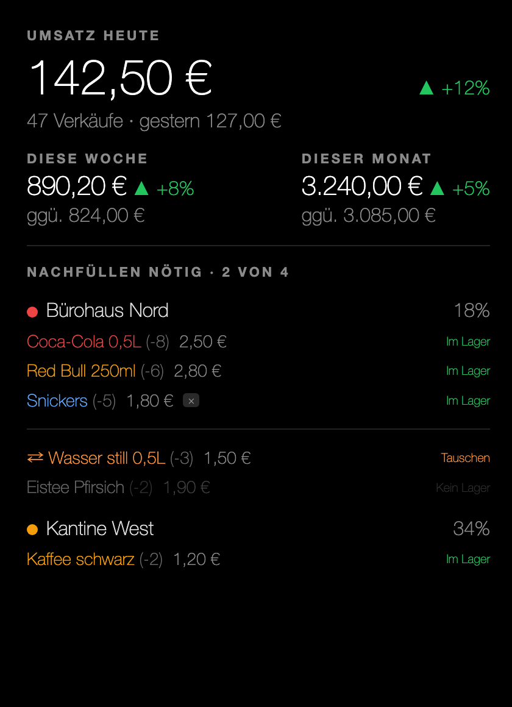
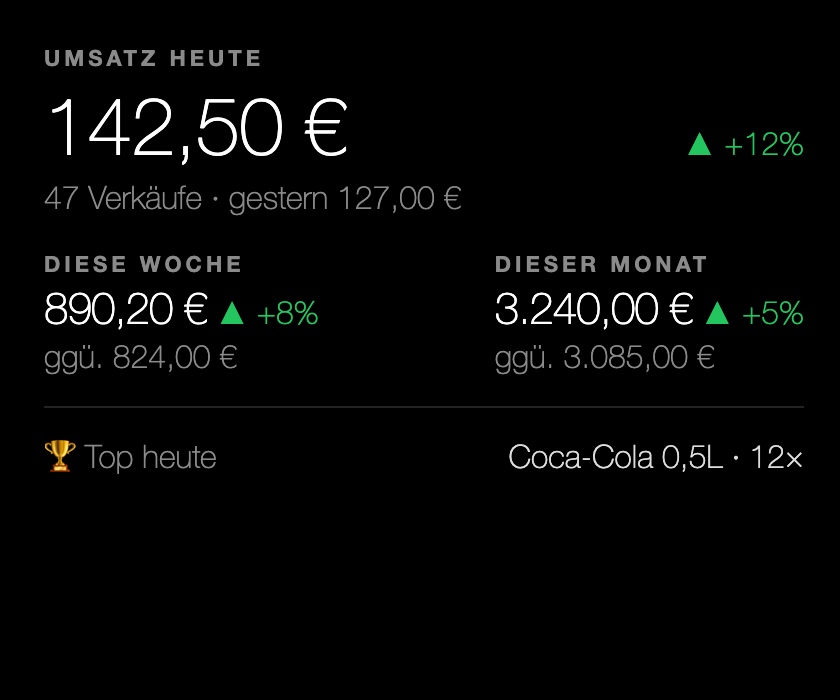
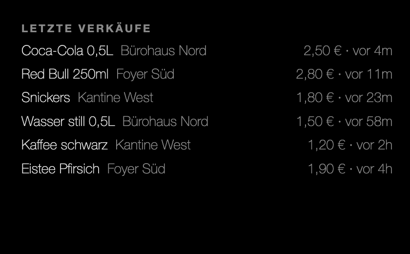
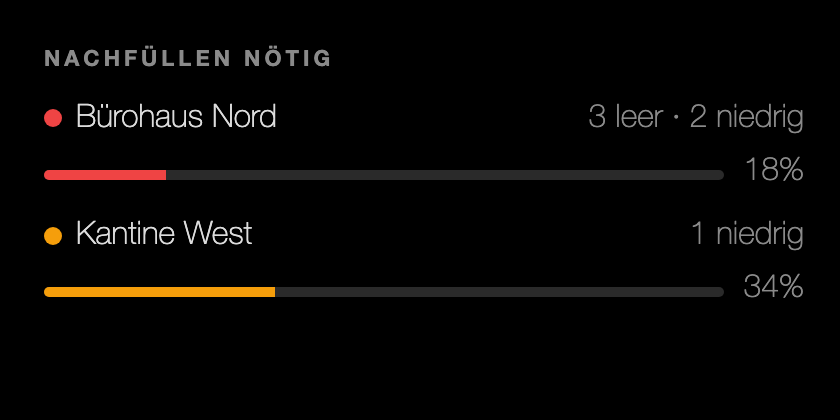
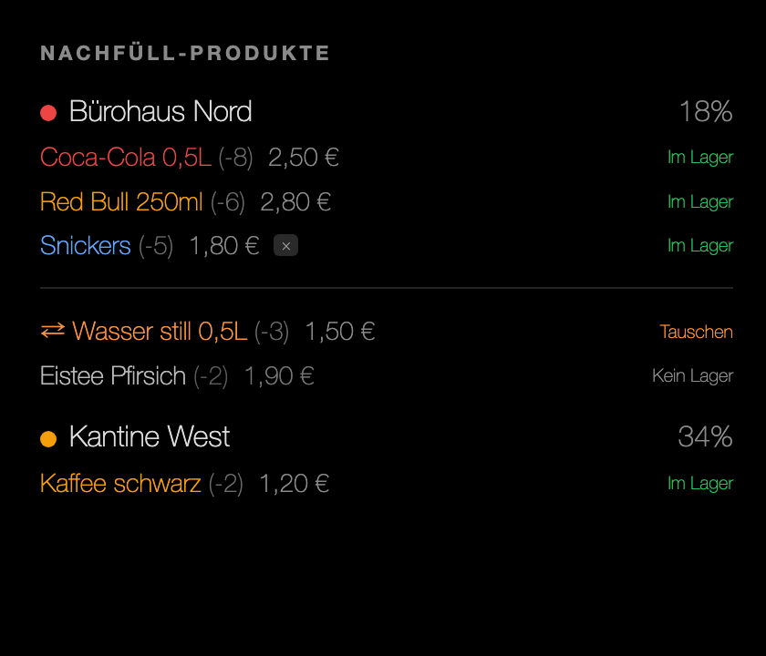
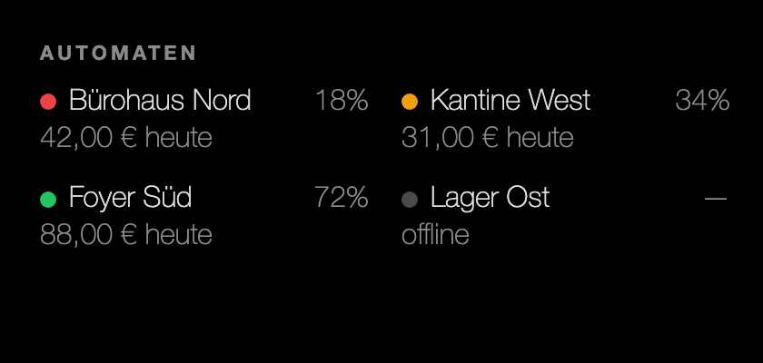
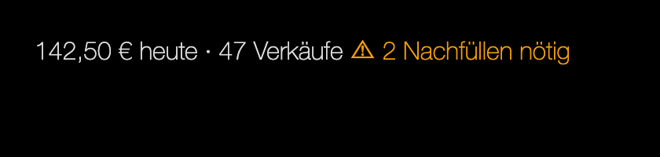

[English](README.md) · **Deutsch**

# MMM-VMflow

Ein [MagicMirror²](https://magicmirror.builders/)-Modul, das Live-Daten von Verkaufsautomaten aus einem selbst gehosteten [VMflow](https://github.com/lucienkerl/mdb-esp32-cashless)-Backend anzeigt — Umsatz-KPIs, letzte Verkäufe, Nachfüllstatus und eine vollständige Automaten-Übersicht — in sieben konfigurierbaren Layouts.



---

## Was wird angezeigt

- **Umsatz-KPIs** — heute, gestern, rollierender 7-Tage-Wochenwert und Kalendermonat, jeweils mit einem Trendprozentsatz im Vergleich zum Vorraum.
- **Live-Verkaufsfeed** — die letzten Verkäufe über alle (oder ausgewählte) Automaten, mit Produktname, Preis, Automatennamen und relativem Zeitstempel.
- **Nachfüllen nötig** — Automaten, die aufgefüllt werden müssen, nach Dringlichkeit sortiert (kritisch zuerst), mit Füllstandsbalken.
- **Nachfüll-Produkte** — produktgenaue Liste pro Automat, farblich nach Schweregrad kodiert (leer → rot, niedrig → orange, auffüllen → blau, Tauschen/Kein Lager → orange), passend zum Management-Dashboard.
- **Automaten** — kompaktes Raster aller Automaten mit Online-/Offline-Status, Lagerstand in Prozent und heutigem Umsatz.
- **Ticker** — eine einzeilige Zusammenfassung für eine obere oder untere Leiste.

Das Modul liefert englische und deutsche Übersetzungen (`?lang=de`). Die Sprache des Backends ist davon unabhängig.

---

## Screenshot-Galerie

### Combo (Cockpit)
Die Standard-Gesamtansicht: heutiger Umsatz + Trend, Wochen-/Monatsblöcke und – pro Automat – die genauen nachzufüllenden Produkte (dieselbe farbcodierte Liste wie das Layout Nachfüll-Produkte).


### KPI
Nur Umsatz-KPIs plus „Top heute". Kompakt und übersichtlich für eine Eckposition.



### Feed (Letzte Verkäufe)
Scrollende Liste der letzten Verkäufe mit Produktname, Automat, Preis und relativem Zeitstempel.



### Nachfüllen nötig
Nach Dringlichkeit sortierte Liste der Automaten, die aufgefüllt werden müssen, mit Füllstandsbalken.



### Nachfüll-Produkte
Detaillierte Produktliste pro Automat mit Produktnamen, Schweregradzfarben, Fehlmengen und den Labels „Im Lager" / „Tauschen".



### Automaten
Zweispaltiges Raster aller Automaten: Statuspunkt, Lagerstand in Prozent und heutiger Umsatz.



### Ticker
Eine Zeile: heutiger Umsatz + Anzahl Verkäufe + Anzahl Nachfüllwarnungen. Gedacht für `top_bar` oder `bottom_bar`.



---

## Voraussetzungen

1. **MagicMirror²** ist installiert und läuft (v2.x, Node ≥ 18).
2. Ein erreichbares **VMflow-Backend** mit den aktiven `/api/v1/`-REST-Endpunkten (selbst gehosteter Docker-Stack oder eine Remote-Instanz).
3. Ein **API-Key**, der im VMflow-Management-Dashboard unter `/api-keys` erstellt wurde. Der Key benötigt Lesezugriff und verlässt niemals die Serverseite des Moduls.

---

## Installation

```bash
cd ~/MagicMirror/modules
git clone https://github.com/lucienkerl/MMM-VMflow MMM-VMflow
```

Ein `npm install` ist nicht erforderlich — dieses Modul hat **keine Laufzeit-Abhängigkeiten**. Nodes eingebautes `fetch` (verfügbar seit Node 18) ist der einzige externe Aufruf.

Die Befehle `npm install` / `npm test` werden nur benötigt, wenn du die Unit-Test-Suite während der Entwicklung ausführen möchtest (siehe [Entwicklung](#entwicklung)).

---

## Konfiguration

### Minimales Beispiel

Füge einen Moduleintrag in die MagicMirror-Datei `config/config.js` ein:

```js
{
  module: "MMM-VMflow",
  position: "top_right",
  config: {
    baseUrl: "http://192.168.1.10:8000",  // URL deines VMflow-Backends
    apiKey:  "vmf_xxxxxxxxxxxxxxxx",       // API-Key aus dem /api-keys-Dashboard
    timezone: "Europe/Berlin",            // deine IANA-Zone — unbedingt setzen! der Host (z. B. ein Pi) läuft oft auf UTC
  }
}
```

Dies verwendet das Standard-Layout `combo` mit einem 60-Sekunden-Abfrageintervall. **Setze `timezone`** auf deine IANA-Zone, damit die „heute"/„Monat"-Summen mit dem Dashboard übereinstimmen — der Mirror-Host (z. B. ein Raspberry Pi) läuft oft auf UTC, wodurch sonst Verkäufe am frühen lokalen Tag fehlen (siehe [Sprache](#sprache) und Fehlerbehebung).

### Alle Konfigurationsoptionen

| Option | Typ | Standard | Beschreibung |
|---|---|---|---|
| `baseUrl` | `string` | `''` | Basis-URL des VMflow-Backends, z. B. `http://192.168.1.10:8000`. Pflichtfeld — das Modul zeigt eine Einrichtungsmeldung, bis dieser Wert gesetzt ist. |
| `apiKey` | `string` | `''` | API-Key aus dem VMflow-Dashboard unter `/api-keys`. Pflichtfeld. **Dieser Key wird ausschließlich in `node_helper.js` gespeichert und verwendet und nie an den Browser übermittelt.** |
| `layout` | `string` | `'combo'` | Welches Layout gerendert werden soll. Mögliche Werte: `combo`, `kpi`, `feed`, `refillStatus`, `refillProducts`, `fleet`, `ticker`. |
| `machineIds` | `string[]` | `[]` | Array von Automaten-UUIDs, die einbezogen werden sollen. Ein leeres Array (Standard) bedeutet alle Automaten des Unternehmens zum API-Key. |
| `updateInterval` | `number` (ms) | `60000` | Wie oft das Backend abgefragt wird, in Millisekunden. Wird auf mindestens 15 000 ms (15 s) begrenzt. |
| `showImages` | `boolean` | `false` | Ob Produkt-Vorschaubilder im Feed und in den Nachfüll-Produkte-Layouts angezeigt werden sollen. Das Backend muss über dasselbe Schema (https) wie der Spiegel erreichbar sein, um Mixed-Content-Fehler zu vermeiden. |
| `maxFeedItems` | `number` | `8` | Maximale Anzahl der Verkäufe im `feed`-Layout. |
| `timezone` | `string\|null` | `null` | IANA-Zeitzonenstring (z. B. `'Europe/Berlin'`) für die Einteilung in „heute/gestern/diesen Monat". `null` (Standard) verwendet die lokale Zeitzone des Spiegel-Hosts. Setze dies, wenn der Mirror in einer anderen Zeitzone als die Automaten betrieben wird. |
| `header` | `string\|null` | `null` | Optionaler MagicMirror-Modul-Header. `null` bedeutet, dass kein Header angezeigt wird. |

### Sprache

Die Benutzeroberfläche des Moduls folgt der **globalen** Spracheinstellung des Mirrors — dem obersten `language`-Feld in `~/MagicMirror/config/config.js` (keine Moduloption):

```js
language: "de", // oder "en"
```

Alle Beschriftungen werden automatisch übersetzt (`en` und `de` sind mitgeliefert; `en` dient als Fallback für jede andere Sprache), und auch die Währungs- und Zahlenformatierung folgt dem `locale`/`language`-Wert des Mirrors. Eine Konfiguration auf Modulebene ist nicht erforderlich. Die obigen Screenshots zeigen die deutsche Oberfläche; die englischen Entsprechungen befinden sich in [`screenshots/en/`](screenshots/en/).

---

## Layout-Handbuch

### `combo` — Cockpit (Standard)

Alles auf einen Blick: heutiger Umsatz, Trends, Wochen-/Monatsblöcke und die pro Automat nachzufüllenden Produkte (dieselbe farbcodierte Liste wie das Layout Nachfüll-Produkte).


**Empfohlene Positionen:** `top_right`, `top_left`

```js
{
  module: "MMM-VMflow",
  position: "top_right",
  config: {
    baseUrl: "http://192.168.1.10:8000",
    apiKey:  "vmf_xxxxxxxxxxxxxxxx",
    layout: "combo",
  }
}
```

---

### `kpi` — Umsatz-KPIs

Heutiger Umsatz, Trends, Wochen-/Monatsvergleiche und das meistverkaufte Produkt heute.


**Empfohlene Positionen:** `top_right`

```js
{
  module: "MMM-VMflow",
  position: "top_right",
  config: {
    baseUrl: "http://192.168.1.10:8000",
    apiKey:  "vmf_xxxxxxxxxxxxxxxx",
    layout: "kpi",
  }
}
```

---

### `feed` — Letzte Verkäufe

Eine Live-Liste der letzten Verkäufe. Passt gut zu einem `refillStatus`-Modul auf der anderen Seite.


**Empfohlene Positionen:** `top_left`, `top_right`

```js
{
  module: "MMM-VMflow",
  position: "top_left",
  config: {
    baseUrl: "http://192.168.1.10:8000",
    apiKey:  "vmf_xxxxxxxxxxxxxxxx",
    layout: "feed",
    maxFeedItems: 10,
    showImages: false,
  }
}
```

---

### `refillStatus` — Nachfüllen nötig

Automaten, die aufgefüllt werden müssen, sortiert von kritisch bis niedrig, mit Füllstandsbalken in Prozent.


**Empfohlene Positionen:** `top_left`, `top_right`

```js
{
  module: "MMM-VMflow",
  position: "top_left",
  config: {
    baseUrl: "http://192.168.1.10:8000",
    apiKey:  "vmf_xxxxxxxxxxxxxxxx",
    layout: "refillStatus",
  }
}
```

---

### `refillProducts` — Nachfüll-Produkte pro Automat

Detaillierte Nachfüllliste pro Automat mit Produktnamen, Schweregradzfarben, Fehlmengen sowie den Labels „Im Lager" / „Tauschen". Konzipiert für den Lager- oder Nachfüllplanungskontext.


**Empfohlene Positionen:** `top_left`, `top_right`

```js
{
  module: "MMM-VMflow",
  position: "top_left",
  config: {
    baseUrl: "http://192.168.1.10:8000",
    apiKey:  "vmf_xxxxxxxxxxxxxxxx",
    layout: "refillProducts",
  }
}
```

---

### `fleet` — Automaten-Übersicht

Kompaktes zweispaltiges Raster aller Automaten: Statuspunkt (Farbe = Lagergesundheit oder offline), Lagerstand in Prozent und heutiger Umsatz.


**Empfohlene Positionen:** `bottom_bar`, `lower_third`

```js
{
  module: "MMM-VMflow",
  position: "bottom_bar",
  config: {
    baseUrl: "http://192.168.1.10:8000",
    apiKey:  "vmf_xxxxxxxxxxxxxxxx",
    layout: "fleet",
  }
}
```

---

### `ticker` — Einzeilige Zusammenfassung

Eine Zeile: heutiger Umsatz, Anzahl Verkäufe und eine Nachfüllwarnungsanzahl. Ideal für eine dedizierte Leistenposition.


**Empfohlene Positionen:** `top_bar`, `bottom_bar`

```js
{
  module: "MMM-VMflow",
  position: "top_bar",
  config: {
    baseUrl: "http://192.168.1.10:8000",
    apiKey:  "vmf_xxxxxxxxxxxxxxxx",
    layout: "ticker",
  }
}
```

---

## Datenaktualität und Rate-Limits

- Das Standard-`updateInterval` beträgt **60 Sekunden** (1 Minute). Das vom Modul erzwungene Minimum liegt bei **15 Sekunden** — niedrigere Werte werden stillschweigend auf 15 000 ms angehoben.
- Die VMflow-API erzwingt ein Rate-Limit von **100 Anfragen pro Minute und API-Key**. Jeder Abfragezyklus ruft sechs Ressourcen parallel ab (Automaten, Geräte, Verkäufe, Fächer, Lagerchargen, Produkte), was 6 Anfragen entspricht.
  - Beim Standard-Intervall von 60 Sekunden sind das 6 Req/Min — weit innerhalb des Limits.
  - Beim Mindestintervall von 15 Sekunden sind das 24 Req/Min — immer noch problemlos.
  - Bei `429`-Fehlern erhöhe `updateInterval` oder bitte deinen VMflow-Administrator, das Rate-Limit pro Key zu erhöhen.
- **Mehrere Modulinstanzen, die dieselbe `baseUrl` und denselben `apiKey` verwenden**, teilen sich einen einzigen Abfragezyklus im `node_helper`. Die Daten werden einmal abgerufen und pro Instanz ein gefiltertes Anzeigemodell erstellt (über `machineIds`). Zwei Instanzen mit unterschiedlichen Abfrageintervallen verwenden das Minimum beider Werte, das Backend wird aber weiterhin nur einmal pro Zyklus abgefragt.

---

## Fehlerbehebung

**Meldung „baseUrl + apiKey in der Config setzen" wird angezeigt**
Das Modul erfordert, dass sowohl `baseUrl` als auch `apiKey` gesetzt sind, bevor es das Backend kontaktiert. Füge sie dem `config.js`-Eintrag hinzu.

**Fehler „API-Key abgelehnt"**
Der Key wurde mit einer `401`-Antwort abgelehnt. Prüfe, ob der API-Key korrekt ist und nicht widerrufen wurde. Keys werden im VMflow-Dashboard unter `/api-keys` verwaltet.

**Fehler „Rate-Limit erreicht"**
Die API hat `429` zurückgegeben. Erhöhe entweder `updateInterval` (z. B. auf `120000` für 2 Minuten) oder bitte deinen VMflow-Administrator, das Anfragen-Limit pro Key zu erhöhen.

**Leere / keine Daten werden angezeigt**
- Wenn noch keine Verkäufe vorliegen, sind die KPIs null und der Feed zeigt „Noch keine Daten" — das ist erwartet.
- Wenn du `machineIds` auf eine Liste von IDs gesetzt hast, stelle sicher, dass diese IDs in deinem Unternehmen existieren und korrekt geschrieben sind (UUIDs).
- Öffne die Entwicklertools im Browser und prüfe die MagicMirror-Serverkonsole auf `[MMM-VMflow]`-Logzeilen.

**Zahlen weichen vom Dashboard ab / Verkäufe um Mitternacht fehlen**
„Heute" / „gestern" / „dieser Monat" werden nach Kalendertag in der **Host-Zeitzone** eingeteilt. Der MagicMirror-Host (oft ein Raspberry Pi) läuft häufig in **UTC**, während das Management-Dashboard Verkäufe in der lokalen Zeitzone deines **Browsers** zählt — dadurch fallen Verkäufe am frühen lokalen Tag (z. B. ein Verkauf um 00:30 = 22:30 UTC am Vortag) in das „gestern" des Hosts und verschwinden aus dem „heute" des Spiegels. Lösung: `timezone` auf deine IANA-Zone setzen und neu starten:
```js
timezone: "Europe/Berlin",
```
Die MagicMirror-Serverkonsole protokolliert die verwendete Zone bei der Registrierung: `[MMM-VMflow] instance registered — bucketing timezone=…` (mit Warnung, falls es der UTC-Host-Standard ist). Den Host kannst du mit `timedatectl` prüfen.

**Produktbilder werden nicht geladen**
- Aktiviere Bilder mit `showImages: true`.
- Der `product-images`-Storage-Bucket des VMflow-Backends muss öffentlich sein.
- Wenn dein Mirror HTTPS verwendet, muss das Backend ebenfalls über HTTPS bereitgestellt werden. Eine Mixed-Content-Richtlinie blockiert Bilder, die über HTTP auf einer HTTPS-Seite geladen werden.
- Bilder werden von `{baseUrl}/storage/v1/object/public/product-images/{path}` bereitgestellt. Prüfe, ob diese URL vom Mirror aus erreichbar ist.

---

## Sicherheit

Der `apiKey` wird ausschließlich in `node_helper.js` gespeichert und verwendet, das im MagicMirror-Serverprozess (Node.js) läuft. Er wird **nie an das Browser-Modul übermittelt** und erscheint in keiner Socket-Benachrichtigung an das Frontend. Der Browser empfängt ausschließlich ein vorgefertigtes Anzeigemodell mit Darstellungsdaten (Umsatzzahlen, Produktnamen, Lagerbestände) — keine Zugangsdaten.

---

## Entwicklung

Führe die Unit-Test-Suite aus (Node ≥ 18 erforderlich):

```bash
npm test
# oder gleichwertig:
node --test
```

Die Suite umfasst `lib/compute.js` (KPI-Bucketung, Trendberechnung, Lagergesundheitslogik, Anzeigemodell-Aufbau) und `lib/api-client.js` (Pagination, 401/429-Fehler-Mapping) — insgesamt 13 Tests.

### Screenshots neu generieren

Screenshots werden aus dem eigenständigen Vorschau-Harness unter `preview/preview.html` erzeugt. Öffne es im Browser mit einem Layout- und Sprachparameter:

```
preview/preview.html?layout=combo&lang=de
preview/preview.html?layout=kpi&lang=de
preview/preview.html?layout=feed&lang=de
preview/preview.html?layout=refillStatus&lang=de
preview/preview.html?layout=refillProducts&lang=de
preview/preview.html?layout=fleet&lang=de
preview/preview.html?layout=ticker&lang=de
```

Die Vorschauseite rendert auf schwarzem Hintergrund mit einem festen 380 px breiten Panel, passend zu einer typischen MagicMirror-Region. Nimm den Panel-Bereich als PNG auf und speichere ihn unter `screenshots/en/<layout>.png` (Englisch) bzw. `screenshots/de/<layout>.png` (Deutsch).

Headless Chrome funktioniert ebenfalls:

```bash
chromium --headless --screenshot=screenshots/en/combo.png \
  --window-size=424,600 \
  "file://$(pwd)/preview/preview.html?layout=combo&lang=en&shot=1"

chromium --headless --screenshot=screenshots/de/combo.png \
  --window-size=424,600 \
  "file://$(pwd)/preview/preview.html?layout=combo&lang=de&shot=1"
```

Der Parameter `shot=1` fügt einen dunklen Körperhintergrund hinzu und entfernt jeden Browser-Chrome aus dem exportierten Bild.

---

## Lizenz

MIT — siehe [LICENSE](LICENSE).

## Danksagungen

- **VMflow** — Open-Source-MDB-Cashless-Zahlungssystem für Verkaufsautomaten: [mdb-esp32-cashless](https://github.com/lucienkerl/mdb-esp32-cashless)
- **MagicMirror²** — die Open-Source-Smart-Mirror-Plattform: [magicmirror.builders](https://magicmirror.builders/)
