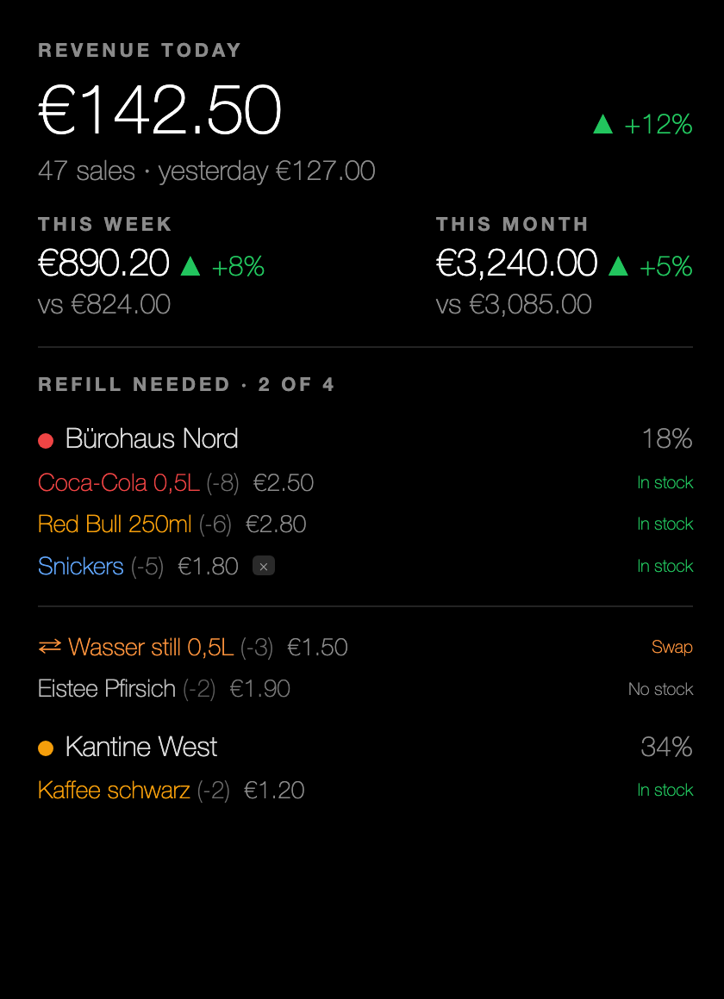
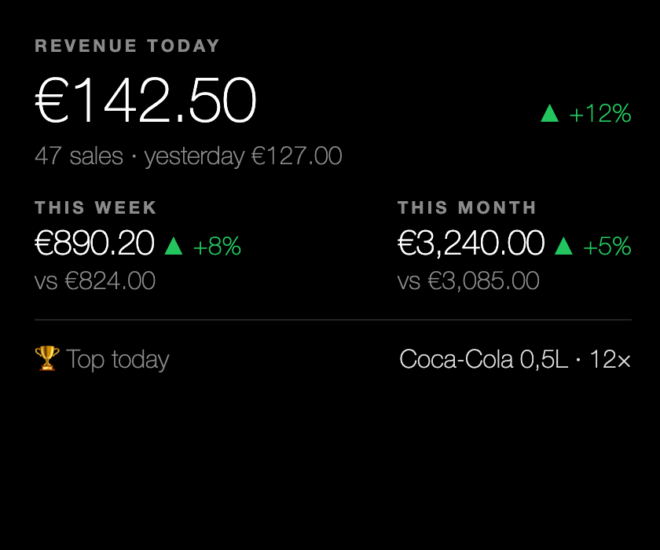
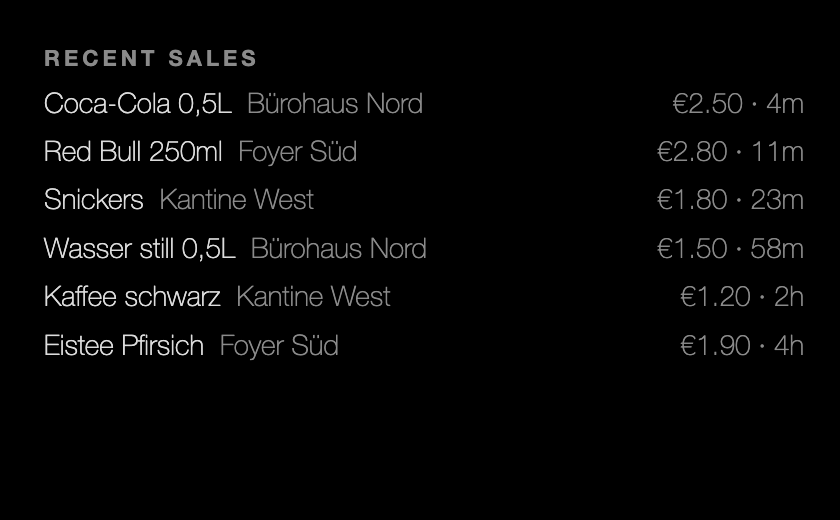
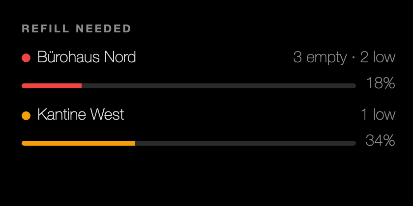
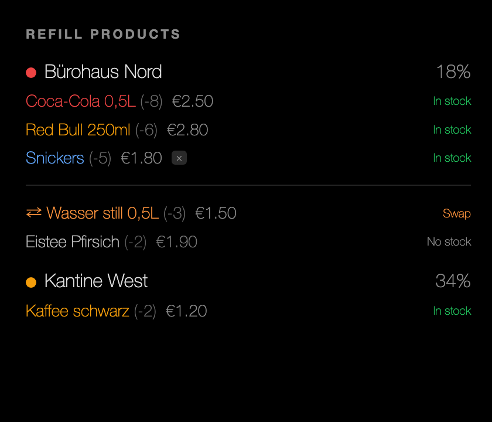
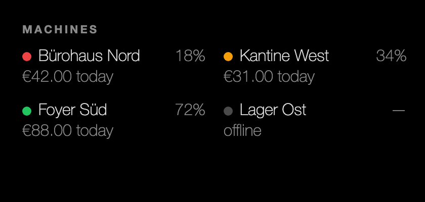

**English** · [Deutsch](README.de.md)

# MMM-VMflow

A [MagicMirror²](https://magicmirror.builders/) module that displays live vending-machine data from a self-hosted [VMflow](https://github.com/lucienkerl/mdb-esp32-cashless) backend — revenue KPIs, recent sales, refill status, and a full fleet overview — in seven configurable layouts.



---

## What it shows

- **Revenue KPIs** — today, yesterday, rolling 7-day week, and calendar month, each with a trend percentage versus the prior period.
- **Live sales feed** — most recent vends across all (or selected) machines, with product name, price, machine name, and relative time.
- **Refill status** — machines needing restocking, urgency-sorted (critical first), with fill-percentage bars.
- **Refill products** — per-machine product lists colour-coded by severity (empty → red, low → amber, fill → blue, swap/no-warehouse → orange), mirroring the management dashboard.
- **Fleet overview** — compact grid of every machine with online/offline status, stock percentage, and today's revenue.
- **Ticker** — a single-line summary for a top or bottom bar.

The module UI ships with English and German translations (`?lang=de`). The backend language is independent.

---

## Screenshot gallery

### Combo (cockpit)
The default all-in-one view: today's revenue + trend, week/month blocks, and — per machine — the exact products to refill (the same colour-coded list as the Refill products layout).


### KPI
Revenue KPIs only, plus "Top product today". Clean and compact for a corner position.



### Feed (recent sales)
Scrolling list of the most recent vends with product name, machine, price, and time-ago.



### Refill status
Urgency-sorted list of machines that need restocking, with fill-percentage bars.



### Refill products
Per-machine breakdown of which specific products to refill or swap, colour-coded by severity.



### Fleet
Two-column grid showing every machine: status dot, stock percentage, and today's revenue.



### Ticker
A single-line summary: today's revenue + sales count + refill alert count. Designed for `top_bar` or `bottom_bar`.


---

## Prerequisites

1. **MagicMirror²** installed and running (v2.x, Node ≥ 18).
2. A reachable **VMflow backend** with the `/api/v1/` REST endpoints live (the self-hosted Docker stack or a remote instance).
3. An **API key** created in the VMflow management dashboard at `/api-keys`. The key needs read access; it never leaves the server side of the module.

---

## Installation

```bash
cd ~/MagicMirror/modules
git clone https://github.com/lucienkerl/MMM-VMflow MMM-VMflow
```

No `npm install` is required — this module has **zero runtime dependencies**. Node's built-in `fetch` (available since Node 18) is the only external call.

The `npm install` / `npm test` commands are only needed if you want to run the unit test suite during development (see [Development](#development)).

---

## Configuration

### Minimal example

Add a module entry to your MagicMirror `config/config.js`:

```js
{
  module: "MMM-VMflow",
  position: "top_right",
  config: {
    baseUrl: "http://192.168.1.10:8000",  // Your VMflow backend URL
    apiKey:  "vmf_xxxxxxxxxxxxxxxx",       // API key from /api-keys dashboard
    timezone: "Europe/Berlin",            // your IANA zone — set this! the host (e.g. a Pi) often defaults to UTC
  }
}
```

This uses the default `combo` layout with a 60-second poll interval. **Set `timezone`** to your IANA zone so the "today"/"month" totals line up with the dashboard — the mirror host (e.g. a Raspberry Pi) often runs UTC, which otherwise drops early-local-day sales (see [Language](#language) and Troubleshooting).

### All configuration options

| Option | Type | Default | Description |
|---|---|---|---|
| `baseUrl` | `string` | `''` | Base URL of the VMflow backend, e.g. `http://192.168.1.10:8000`. Required — the module shows a setup message until this is set. |
| `apiKey` | `string` | `''` | API key created in the VMflow dashboard at `/api-keys`. Required. **This key is held exclusively in `node_helper.js` and is never sent to the browser.** |
| `layout` | `string` | `'combo'` | Which layout to render. One of: `combo`, `kpi`, `feed`, `refillStatus`, `refillProducts`, `fleet`, `ticker`. |
| `machineIds` | `string[]` | `[]` | Array of machine UUIDs to include. Empty array (the default) means all machines for the API key's company. |
| `updateInterval` | `number` (ms) | `60000` | How often to poll the backend, in milliseconds. Floored to 15 000 ms (15 s). |
| `showImages` | `boolean` | `false` | Whether to display product thumbnail images in the feed and refill-products layouts. Requires the backend to be reachable over the same scheme (https) as the mirror to avoid mixed-content errors. |
| `maxFeedItems` | `number` | `8` | Maximum number of sales to show in the `feed` layout. |
| `maxRefillRows` | `number\|null` | `null` | Maximum number of product rows shown **in total** across machines (`combo` / `refillProducts`). `null` (the default) shows all; when more exist, a "… N more products" line is appended. Bounds overall height. |
| `maxRowsPerMachine` | `number\|null` | `null` | Maximum product rows shown **per machine** (each machine lists its most critical items first — red → amber → blue, then by needed quantity; a "+K more" line appears under a capped machine). `null` shows all. Composes with `maxRefillRows` — per-machine keeps every machine visible, the total bounds height. |
| `timezone` | `string\|null` | `null` | IANA timezone string (e.g. `'Europe/Berlin'`) used for "today/yesterday/this month" bucketing. `null` (the default) uses the mirror host's local timezone. Set this if your mirror runs in a different timezone from the vending machines. |
| `header` | `string\|null` | `null` | Optional MagicMirror module header. `null` means no header is shown. |

### Language

The module's UI follows your mirror's **global** language setting — the top-level `language` field in `~/MagicMirror/config/config.js` (not a per-module option):

```js
language: "de", // or "en"
```

All labels are translated automatically (`en` and `de` are bundled; `en` is used as a fallback for any other language), and currency/number formatting follows the mirror's `locale`/`language` too. No module-level configuration is needed. The screenshots above show the English UI; the German equivalents are in [`screenshots/de/`](screenshots/de/).

---

## Per-layout guide

### `combo` — Cockpit (default)

Everything at a glance: today's revenue, trends, week/month blocks, and the per-machine products to refill (the same colour-coded list as the Refill products layout).


**Recommended positions:** `top_right`, `top_left`

```js
{
  module: "MMM-VMflow",
  position: "top_right",
  config: {
    baseUrl: "http://192.168.1.10:8000",
    apiKey:  "vmf_xxxxxxxxxxxxxxxx",
    layout: "combo",
  }
}
```

---

### `kpi` — Revenue KPIs

Today's revenue, trends, week/month comparisons, and the top-selling product today.


**Recommended positions:** `top_right`

```js
{
  module: "MMM-VMflow",
  position: "top_right",
  config: {
    baseUrl: "http://192.168.1.10:8000",
    apiKey:  "vmf_xxxxxxxxxxxxxxxx",
    layout: "kpi",
  }
}
```

---

### `feed` — Recent sales

A live list of the most recent vends. Pairs well with a `refillStatus` module on the other side.


**Recommended positions:** `top_left`, `top_right`

```js
{
  module: "MMM-VMflow",
  position: "top_left",
  config: {
    baseUrl: "http://192.168.1.10:8000",
    apiKey:  "vmf_xxxxxxxxxxxxxxxx",
    layout: "feed",
    maxFeedItems: 10,
    showImages: false,
  }
}
```

---

### `refillStatus` — Refill urgency

Machines needing restocking, sorted critical → low, with stock-percentage fill bars.


**Recommended positions:** `top_left`, `top_right`

```js
{
  module: "MMM-VMflow",
  position: "top_left",
  config: {
    baseUrl: "http://192.168.1.10:8000",
    apiKey:  "vmf_xxxxxxxxxxxxxxxx",
    layout: "refillStatus",
  }
}
```

---

### `refillProducts` — Per-machine product list

Detailed per-machine refill list with product names, severity colours, deficit counts, and in-stock / swap tags. Designed for a warehouse or refill planning context.


**Recommended positions:** `top_left`, `top_right`

```js
{
  module: "MMM-VMflow",
  position: "top_left",
  config: {
    baseUrl: "http://192.168.1.10:8000",
    apiKey:  "vmf_xxxxxxxxxxxxxxxx",
    layout: "refillProducts",
  }
}
```

---

### `fleet` — Machine overview grid

Compact two-column grid of all machines: status dot (colour = stock health or offline), stock percentage, and today's revenue.


**Recommended positions:** `bottom_bar`, `lower_third`

```js
{
  module: "MMM-VMflow",
  position: "bottom_bar",
  config: {
    baseUrl: "http://192.168.1.10:8000",
    apiKey:  "vmf_xxxxxxxxxxxxxxxx",
    layout: "fleet",
  }
}
```

---

### `ticker` — Single-line summary

One line: today's revenue, sales count, and a refill-needed warning count. Ideal for a dedicated bar position.


**Recommended positions:** `top_bar`, `bottom_bar`

```js
{
  module: "MMM-VMflow",
  position: "top_bar",
  config: {
    baseUrl: "http://192.168.1.10:8000",
    apiKey:  "vmf_xxxxxxxxxxxxxxxx",
    layout: "ticker",
  }
}
```

---

## Data freshness and rate limits

- The default `updateInterval` is **60 seconds** (1 minute). The minimum enforced by the module is **15 seconds** — lower values are silently raised to 15 000 ms.
- The VMflow API enforces a rate limit of **100 requests per minute per API key**. Each poll cycle fetches six resources (machines, devices, sales, trays, stock-batches, products) in parallel, which counts as 6 requests.
  - At the 60-second default that is 6 req/min — well within limits.
  - At the minimum 15-second interval that is 24 req/min — still fine.
  - If you hit `429` errors, raise `updateInterval` or ask your VMflow admin to increase the per-key rate limit.
- **Multiple module instances sharing the same `baseUrl` and `apiKey`** share a single poll cycle in `node_helper`. The data is fetched once and a filtered view model is built per instance (using `machineIds`). This means two instances at different poll intervals will use the minimum of the two values, but the backend is still only hit once per cycle.

---

## Troubleshooting

**"Set baseUrl + apiKey in config" message appears**
The module requires both `baseUrl` and `apiKey` to be set before it will contact the backend. Add them to your `config.js` entry.

**"API key rejected" error**
The key was rejected with a `401` response. Check that the API key is correct and has not been revoked. Keys are managed in the VMflow dashboard at `/api-keys`.

**"Rate limited" error**
The API returned `429`. Either raise `updateInterval` (e.g. to `120000` for 2 minutes), or ask your VMflow admin to increase the per-key request limit.

**Blank / empty display (no data)**
- If you have no sales yet, KPIs will be zero and the feed will show "No data yet" — this is expected.
- If you set `machineIds` to a list of IDs, make sure those IDs exist in your company and are spelled correctly (UUIDs).
- Open your browser's developer tools and check the MagicMirror server console for `[MMM-VMflow]` log lines.

**Numbers differ from the dashboard, or sales around midnight are missing**
"Today" / "yesterday" / "this month" are bucketed by calendar day in the **host** timezone. The MagicMirror host (often a Raspberry Pi) frequently runs **UTC**, while the management dashboard counts sales in your **browser's** local timezone — so early-local-day sales (e.g. a 00:30 sale = 22:30 UTC the previous day) fall into the host's "yesterday" and disappear from the mirror's "today". Fix: set `timezone` to your IANA zone and restart:
```js
timezone: "Europe/Berlin",
```
The MagicMirror server console logs the effective zone when the module registers: `[MMM-VMflow] instance registered — bucketing timezone=…` (it warns when it's the UTC host default). You can also check the host with `timedatectl`.

**Product images are not loading**
- Enable images with `showImages: true`.
- The VMflow backend's `product-images` storage bucket must be public.
- If your mirror uses HTTPS, the backend must also be served over HTTPS. A mixed-content policy will block images loaded over HTTP on an HTTPS page.
- Images are served from `{baseUrl}/storage/v1/object/public/product-images/{path}`. Verify this URL is accessible from the mirror.

---

## Security

The `apiKey` is stored and used exclusively in `node_helper.js`, which runs in the MagicMirror server process (Node.js). It is **never passed to the browser module** and never appears in any socket notification sent to the frontend. The browser only receives a pre-built view model containing display data (revenue numbers, product names, stock counts) — no credentials.

---

## Development

Run the unit test suite (Node ≥ 18 required):

```bash
npm test
# or equivalently:
node --test
```

The suite covers `lib/compute.js` (KPI bucketing, trend calculation, stock-health logic, view model assembly) and `lib/api-client.js` (pagination, 401/429 error mapping) — 13 tests total.

### Regenerating screenshots

Screenshots are generated from the standalone preview harness at `preview/preview.html`. Open it in a browser with a layout and language parameter:

```
preview/preview.html?layout=combo&lang=de
preview/preview.html?layout=kpi&lang=en
preview/preview.html?layout=feed&lang=de
preview/preview.html?layout=refillStatus&lang=de
preview/preview.html?layout=refillProducts&lang=de
preview/preview.html?layout=fleet&lang=de
preview/preview.html?layout=ticker&lang=de
```

The preview page renders on a black background with a fixed 380 px wide panel, matching a typical MagicMirror region. Capture the panel area to a PNG and save it to `screenshots/en/<layout>.png` (English) or `screenshots/de/<layout>.png` (German).

Headless Chrome also works:

```bash
chromium --headless --screenshot=screenshots/en/combo.png \
  --window-size=424,600 \
  "file://$(pwd)/preview/preview.html?layout=combo&lang=en&shot=1"

chromium --headless --screenshot=screenshots/de/combo.png \
  --window-size=424,600 \
  "file://$(pwd)/preview/preview.html?layout=combo&lang=de&shot=1"
```

The `shot=1` parameter adds a dark body background and removes any browser chrome from the exported image.

---

## License

MIT — see [LICENSE](LICENSE).

## Credits

- **VMflow** — open-source MDB cashless payment system for vending machines: [mdb-esp32-cashless](https://github.com/lucienkerl/mdb-esp32-cashless)
- **MagicMirror²** — the open-source smart mirror platform: [magicmirror.builders](https://magicmirror.builders/)
